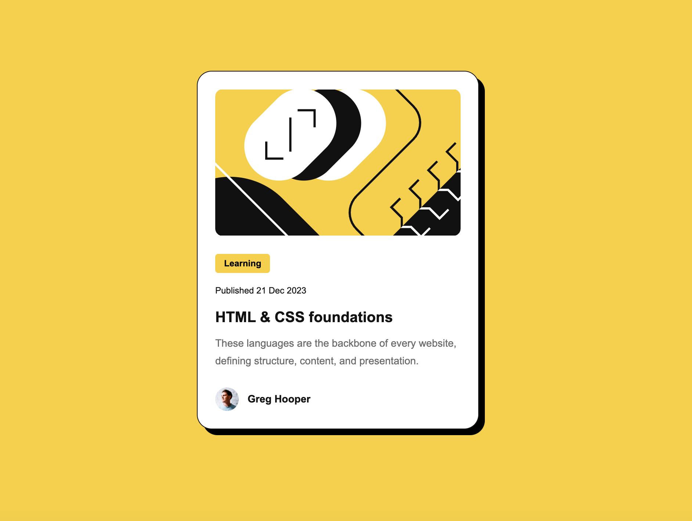

# Frontend Mentor - Blog preview card solution

This is a solution to the [Blog preview card challenge on Frontend Mentor](https://www.frontendmentor.io/challenges/blog-preview-card-ckPaj01IcS). Frontend Mentor challenges help you improve your coding skills by building realistic projects. 

## Table of contents

- [Frontend Mentor - Blog preview card solution](#frontend-mentor---blog-preview-card-solution)
  - [Table of contents](#table-of-contents)
  - [Overview](#overview)
    - [Screenshot](#screenshot)
    - [Links](#links)
  - [My process](#my-process)
    - [Built with](#built-with)
    - [What I learned](#what-i-learned)
    - [Continued development](#continued-development)
  - [Author](#author)

## Overview

### Screenshot

### Links

- Solution URL: [Code](https://github.com/bryancarias/BlogPreviewCardMain)
- Live Site URL: [Demo](https://blog-preview-card-main-delta-lemon.vercel.app/)

## My process

### Built with

- HTML
- CSS

### What I learned

In addition to learning how to utilize functions to determine the card sizes, I also learnt how to use a hover effect to alter the color or other internal features of the same card.

### Continued development

Keep practicing, as I only know the basics, but I've never worked on significant projects when it comes to frontend design.

## Author

- Frontend Mentor - [@bryancarias](https://www.frontendmentor.io/profile/bryancarias)